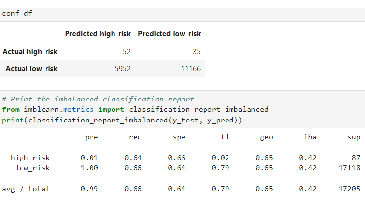
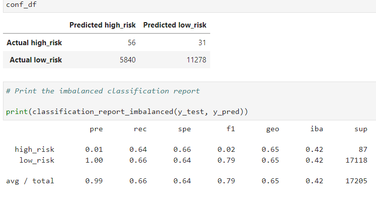
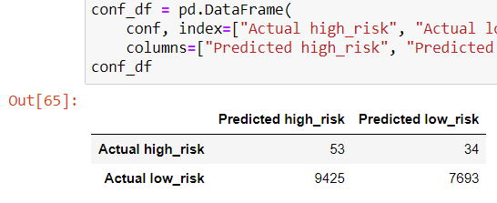
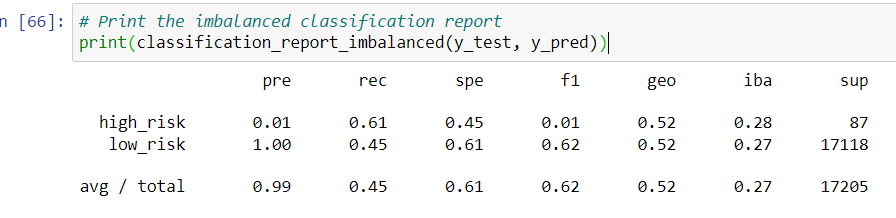
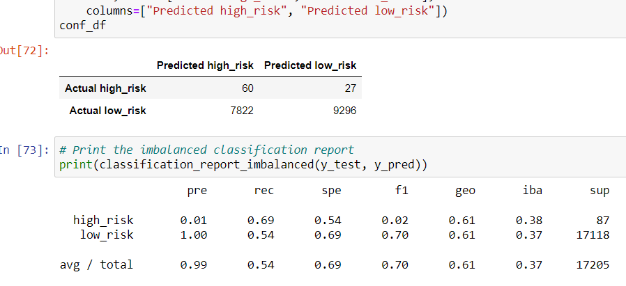
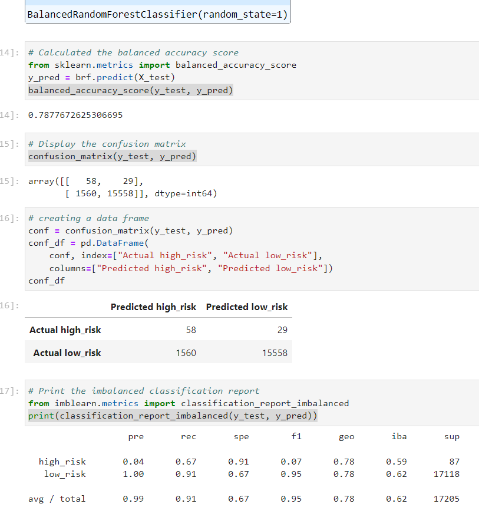
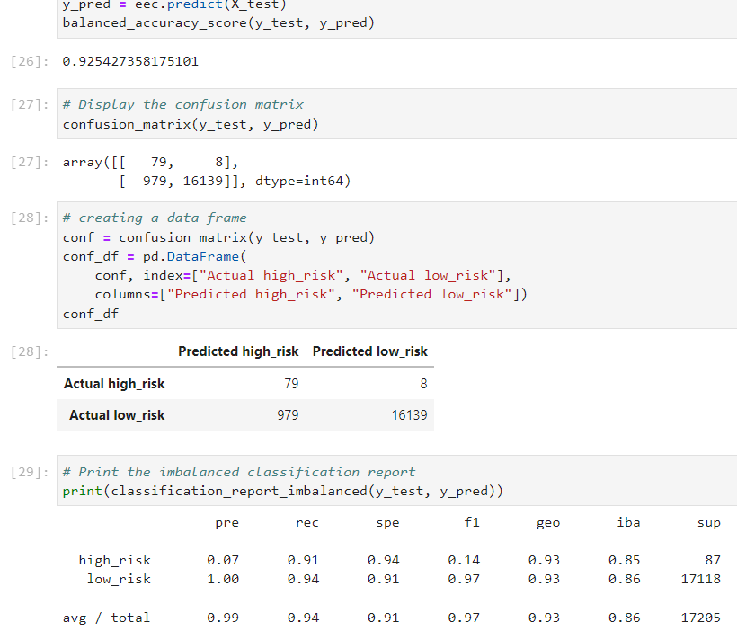

# Credit_Risk_Analysis
## Overview of the analysis: 
In this analysis we used the credit card credit dataset from LendingClub, oversampled the data using the RandomOverSampler and SMOTE algorithms, and undersampled the data using the ClusterCentroids algorithm. After this we used combinatorial approach of over- and undersampling using the SMOTEENN algorithm. Lastly, we compared two new machine learning models that reduce bias, BalancedRandomForestClassifier and EasyEnsembleClassifier, to predict credit risk.
## Results:
- The analysis began with analyzing the data by using oversampling or Random Over Sampler to resample the data.The results show accuracy score as 62%. Precision for high risk is low 1%

indicating a large number of false positives, which indicates an unreliable classification and recall being 64%.
- Therefore we perform SMOTE oversampling next. 

Here as we see the precision high riskis again 1% and recall is 64% with accuracy score of 53%. Not showing much improvement.
- Next we performed undersampling algorithm to resample the data.

In this analysis we got an accuracy score of 53% and precision for high risk was same as before whreas recall was 61%.
- Next we did a combination of over and undersampling to look at scores, resampling the data using Smoteenn algorithm.

The combination algorithm gave us an accuracy score of 62%, whereas precision for high risk was again the same at !%. The recall for high risk was 68%.
- Resamling of data was done again using BalancedRandomForestClassifier algorithm with 100 estimators.

This algorithm showed an accuracy score of 79% and high risk precision was 4% with 67% recall.
- Next,we resampled  data using the EasyEnsembleClassifier algorithm with 100 estimators.

Here as we see the accuracr score has gone very high to 93% and precision total is 99% whereas recall totalis 94%. The FI score total at 97% also indicates a good score.
## Summary:
The two oversample models, the undersample and the combination models were not able to perform well as we can infer from the accuracy scores as well as looking at precision and recall percentages. But the ensemle models- BalancedRandomForestClassifier and EasyEnsembleClassifier performed better. There accuracy score was very good The total recall being high is also good. Also total F1 score is good. So, the models high accuracy is good at predicting the credit risk which the company maybe looking for. True Positives being high for the ensemble models predict that it is a good at predicting credit risk.